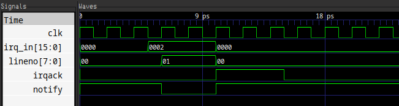
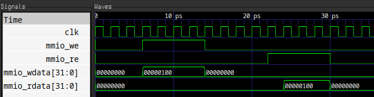

# Platform Interrupt Message Controller (PIMC)

The PIMC is responsible for receiving Interrupt Requests (IRQs) from peripherals
and routing them to a processor. There can be several peripherals in the system,
each connected to their respective IRQ lines.

## PIMC Signals

| Signal      | Purpose                     |
| ----------  | --------------------------- |
| IRQACK      | Interrupt acknowledgement   |
| LINENO[7:0] | IRQ line to be serviced     |
| NOTIFY#     | Signals an active IRQ       |
| MMIO_ADDR   | MMIO r/w address            |
| MMIO_RE     | MMIO read enable            |
| MMIO_WE     | MMIO write enable           |
| MMIO_WDATA  | MMIO write data             |
| MMIO_RDATA  | MMIO read data              |
| CLK         | PIMC Clock                  |

## PIMC Startup State

| Signal      | State     |
| ----------  | --------  |
| IRQACK      | LOW (0)   |
| LINENO[7:0] | UNDEFINED |
| NOTIFY#     | UNDEFINED |

## PIMC Initialization Process

During system startup, LINENO[7:0] and NOTIFY# will be in an undefined state. Stage 1 firmware
is responsible for initializing the PIMC before it is ready for operation. The PIMC is initialized
by pulsing IRQACK high for at least 2 ms.

As soon as a rising edge of the PIMC CLK signal occurs with IRQACK pulled high, NOTIFY# is pulled high
and LINENO[7:0] becomes zero.

## Signalling

When a peripheral needs to signal an event, it pulses its IRQ line high for 1 ms which results in
NOTIFY# being pulled low and LINENO[7:0] set to the source line number. After an IRQ has been handled,
it can be acknowledged by pulsing IRQACK high for 2 ms. After an IRQ has been acknowledged, NOTIFY#
is pulled high and LINENO[7:0] is cleared to zero.

## MMIO Interface

Some registers within the PIMC chip are memory mapped and can be accessed through the MMIO interface. For example,
the IRQ table is accessed through physical address 0x1000 + OFFSET.

### MMIO Interface Semantics

The MMIO_ADDR input from mainbus is set to the address being accessed. The MMIO_RE (Read Enable) and
MMIO_WE (Write Enable) signals are used for read/write operations and are mutually exclusive. As soon as one
of these signals are pulled high, data transfer begins.

- Pulse MMIO_RE high to read data onto MMIO_RDATA.
- Pulse MMIO_WE high to write data from MMIO_WDATA.

### MMIO Interface Registers

#### IRQ Table

The IRQ table is a set of registers that manage where and how IRQs get directed.
The IRQ line number acts as the index into this table.

| Bits        | Field         |
| ----------- | ------------- |
| 7:0         | Processor ID  |
| 8           | Line mask     |
| 31:9        | Reserved      |

The Processor ID field contains the ID of the processor for this IRQ to be directed to.
If the Line Mask bit is set to 1, the PIMC chip will ignore interrupts from this line.
